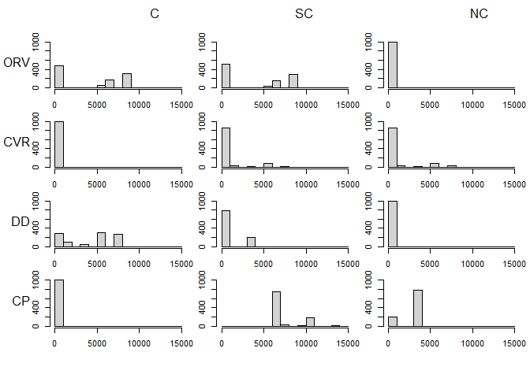
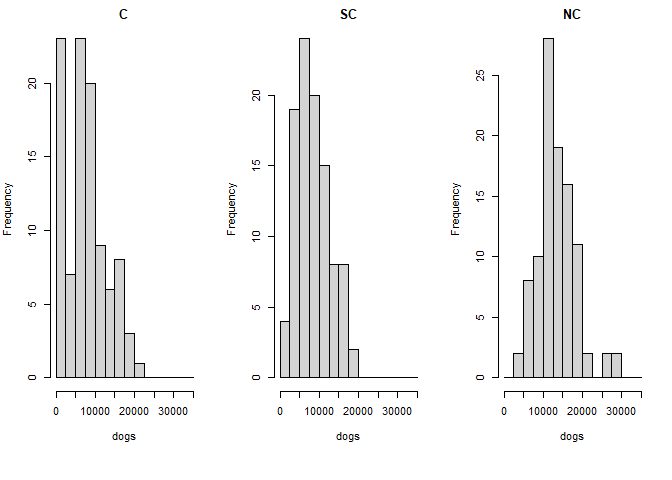

# Optimizing rabies vaccine programs for dogs

Our goal is to use standard optimization tools to find the most cost-effective rabies vaccination strategy. This doc is take 5: find best and lowest cost solution.

We're using information from:

[Wallace, R. M., Undurraga, E. A., Gibson, A., Boone, J., Pieracci, E. G., 
Gamble, L., & Blanton, J. D. (2019). Estimating the effectiveness of 
vaccine programs in dog populations. Epidemiology & Infection, 147.](https://www.cambridge.org/core/services/aop-cambridge-core/content/view/E0D25E5DFB352731121EDBA5DEFEF7EE/S0950268819001158a.pdf/estimating-the-effectiveness-of-vaccine-programs-in-dog-populations.pdf)

online version [https://rabiestaskforce.com/toolkit/vaxplan/](https://rabiestaskforce.com/toolkit/vaxplan/)

# Dog population structure

The dog population is thought of as consisting of always confined dogs (C), sometimes confined dogs (SC), and never confined (NC). The status is independent of ownership, and the population of free-roaming dogs is therefore SC+NC.

If we know the total dog population and the percent in each category, we can also estimate numbers this way.

To start, we're just using the default values from the online tool.


```r
# Dt=total dog population 
# pC[i] = proportion of dogs in each category
# Categories are C always confined, SC sometimes confined, NC never confined
# and sum to one

Dt=30000
C=0.28
NC=0.48
SC=1-(C+NC)
pC=c(C,SC,NC)
d=Dt*pC
```


# Accessibility

Wallace et al (2019) have a category called accessibility,
which seems to relate to how easy it is to administer the vaccine, using the delivery method. These methods are central point (CP), door-to-door (DD), capture, vaccinate and release (CVR), and oral bait handout (ORV). The first three methods use an injectable vaccine.


```r
# vaccine efficacy estimates
# pve = probability of vaccinating a dog in category C using method i
# methods are CP - central point, DD-door to door, 
# CVR-capture, vaccinate, release, ORV-oral bait
# values from Wallance (assume ORV is more effective with never confined)

CP=c(.95,.80,.05)
DD=c(.95,.80,.05)
CVR=c(.05,.95,.80)
ORV=c(.05,.95,.95)

pve=data.frame(CP,DD,CVR,ORV)
vaxcats=colnames(pve)
dogcats=c("C", "SC", "NC")
rownames(pve)=dogcats
```

# Vaccine Solutions

At this point Wallace t al. (2019) describe an "iterative set of equations to 
define the number of vaccinated dogs in each category by vaccine method, using 
number of of vaccines. A pre-defined rank order is defined 
to determine which category would be most accessible for a given method
and allocated vaccines applied to that category first, before applying remainder 
to the next category, until all vaccines used. Excess is waste"

For example, the spreadsheet gives the following ranking


```r
#vaccine ranking
C_V=c(1,1,3,3)
SC_V=c(2,2,1,2)
NC_V=c(3,3,2,1)

pvr=t(data.frame(C_V,SC_V,NC_V))
rownames(pve)=dogcats
colnames(pve)=vaxcats
pvr
```

```
     [,1] [,2] [,3] [,4]
C_V     1    1    3    3
SC_V    2    2    1    2
NC_V    3    3    2    1
```

I'm not sure why this is "predefined", since we can certainly turn the
given efficacy into rank. Although I also note a small discrepancy
in the ranking of SC given by the spreadsheet, so maybe there is another factor here.


```r
# turn efficacy into rank
rank.pve=pve
ad=cut(as.matrix(rank(-pve)), 3, labels=c(1:3))
rank.pve[] <- as.numeric(ad)
rank.pve
```

```
   CP DD CVR ORV
C   1  1   3   3
SC  2  2   1   1
NC  3  3   2   1
```

The online tool then starts with the idea that a given number of vaccines 
have been obtained, and they need to be allocated using an iterative process
embodied in their spreadsheet according to a predefined vaccine strategy.


```r
#vaccines obtained
#St = total number of vaccine doses obtained
#pm = proportion of doses allocated to each vaccination method 
inj=20400
ob=3600
```

Rather than examining a pre-determined vaccination strategy that may or may not be successful, it seems much simpler to simply allocate the vaccines to different methodss given the probability of success for the various dog categories using linear programming. 

However, I do note that when this is done, there is no particular priority given to
any dog category, so that we do need to define the end goal (i.e., 70% coverage in each category, or only in some high priority category). Otherwise, some optimal solutions end up with only 1 or 2 categories of dogs being vaccinated when there are not enough vaccines to go around. 

Other constraints include:
1. not exceeding the total number of vaccines, and 2. not exceeding the total
number of dogs in each category. 

Please note for reference that this is a "transportation problem" with additional constraints.


```r
#### optimize with constraints for a given number of 
#### vaccines, using regular lp function
library(lpSolve)
obj=c(t(as.matrix(pve)))*100
m <- 3
n <- 4
constr <- matrix (0 , n +m , n*m )
for(i in 1:m){ 
  for(j in 1:n){ 
    constr[i, n*(i-1) + j] <- 1
    constr[m+j, n*(i-1) + j] <- 1
  }
}
# this array will ensure we cannot exceed the number of dogs in 
# a category, and that a given the number of vaccines in a category
# cannot exceed the total

injc=c(1,1,1,0,1,1,1,0,1,1,1,0) # all categories summed cannot exceed inj vaccines
obhc=c(0,0,0,1,0,0,0,1,0,0,0,1) #all categories summed cannot exceed obh vaccines
cover1=c(c(1,1,1,1,0,0,0,0,0,0,0,0)) #required coverage C
cover2=c(c(0,0,0,0,1,1,1,1,0,0,0,0)) #required coverage SC
cover3=c(c(0,0,0,0,0,0,0,0,1,1,1,1)) #required coverage NC

constr=rbind(constr, injc, obhc, cover1, cover2, cover3)
rhs <- c(d[1], d[2], d[3], inj, inj, inj, 
         ob, inj, ob, 0.7*d[1],0.7*d[2],0.7*d[3])
constr.dir <- c(rep("<=",m ), rep("<=", n+2),
                rep(">=",3))


prod.trans <- lp ("max", objective.in=obj, 
                  constr, constr.dir, rhs)
soln=(matrix(prod.trans$solution, nrow=4))
solntab=(rbind(soln,colSums(soln)/d ))
colnames(solntab)=dogcats
rownames(solntab)=c(vaxcats, "%vax")
knitr::kable(solntab, digits=2, caption="Table: Optimal vaccine allocation strategy")
```


Table: Table: Optimal vaccine allocation strategy

|     |    C|      SC|     NC|
|:----|----:|-------:|------:|
|CP   | 8400|    0.00|    0.0|
|DD   |    0|    0.00|    0.0|
|CVR  |    0| 5520.00| 6480.0|
|ORV  |    0|    0.00| 3600.0|
|%vax |    1|    0.77|    0.7|

This solution gives us good coverage, but I bet the expense of CVR makes it untenable. Next up... incorporate uncertainty.


## Uncertainty in effective vaccine delivery 


Confidence intervals for these predictions are not easy to generate analytically (*ref). Instead, we will use a Monte Carlo method to quantify uncertainty. To do this for the probability of delivery an effective vaccine dose for each category of dog and vaccination method, we will draw random values from a beta distribution and calculate the optimization solution many times. 

the beta distribution is a continuous probability distribution that models random variables with values falling inside a finite interval, and we can use it to model the success rates of the vaccination methods (bounded by 0 and 1). The distribution is particularly flexible at modeling different curves within the interval, including symmetrical, left and right-skewed, U and inverted U shapes, and straight lines. The  two shape parameters, α and β determine the shape and must be positive.  Using the tight relationship between the beta and binomial distribution, we can set these parameters easily, for example with 10 trials and 7 successes we would have: 
    α = 7 + 1 = 8,
    β = 10 – 7 + 1 = 4

which would give a left-skewed distribution centered on 0.7.


```r
## Visualization, including limit cases:
pl.beta <- function(a,b, asp = if(isLim) 1, ylim = if(isLim) c(0,1.1)) {
  if(isLim <- a == 0 || b == 0 || a == Inf || b == Inf) {
    eps <- 1e-10
    x <- c(0, eps, (1:7)/16, 1/2+c(-eps,0,eps), (9:15)/16, 1-eps, 1)
  } else {
    x <- seq(0, 1, length.out = 1025)
  }
  fx <- cbind(dbeta(x, a,b), pbeta(x, a,b), qbeta(x, a,b))
  f <- fx; f[fx == Inf] <- 1e100
  matplot(x, f, ylab="", type="l", ylim=ylim, asp=asp,
          main = sprintf("[dpq]beta(x, a=%g, b=%g)", a,b))
  abline(0,1,     col="gray", lty=3)
  abline(h = 0:1, col="gray", lty=3)
  legend("top", paste0(c("d","p","q"), "beta(x, a,b)"),
         col=1:3, lty=1:3, bty = "n")
  invisible(cbind(x, fx))
}

aval=7+1
bval=10-7+1

aval
```

```
[1] 8
```

```r
bval
```

```
[1] 4
```

```r
pl.beta(aval, bval)
```

<!-- -->


Then we use this distribution with many simulations, using our original probability values.


```r
# function to generate random vaccine efficacy matrix
rbpve<-function(x){
aval=x*10+1
bval=10-x*10+1
y=rbeta(1, aval, bval)
return(y)
}

# function to calculate optimal allocation with random matrix draw
# many times

randvax<-function(pve,d, Dp, C, NC) {

covmat=matrix(NA, nrow=1000, ncol=3)
mclist=list()
plist=list()
for (i in 1:1000){
  p=apply(pve, c(1,2), rbpve)
  plist[[i]]=p
  obj=c(t(as.matrix(p)))*100
  prod.trans <- lp ("max", objective.in=obj,constr, constr.dir, rhs)

  soln=(matrix(prod.trans$solution, nrow=4))
mclist[[i]]=soln
covmat[i,]=colSums(soln)/d
}
return(list(mclist, covmat, plist))
}
multilist=randvax(pve,d, Dp=Dt, C=C, NC=C)

newvax<-function(pve,d, Dp, C, NC) {
  print(Dp)
}
newvax(pve,d, Dp=Dt, C, NC)
```

```
[1] 30000
```

```r
#function to tabulate the resulting simulations

tabprep<-function(flist) {
mclist=multilist[1]
plist=multilist[3]
#  Make a 3D array from list of matrices
arr <- array( unlist(mclist) , c(4,3,1000) )
parr<-array( unlist(plist) , c(3,4,1000) )

#  Get summaries of third dimension
mdarr=apply( arr , 1:2 , median)
mxarr=apply( arr , 1:2 , max)
mnarr=apply( arr , 1:2 , min)

mdp=round(apply( parr , 1:2 , median), 2)
mxp=round(apply( parr , 1:2 , max), 2)
mnp=round(apply( parr , 1:2 , min), 2)
pmat=matrix(paste(mdp, "(", mnp, "-", mxp, ")"), nrow=3,ncol=4)
row.names(pmat)=dogcats
omat=t(matrix(paste(mdarr, "(", mnarr, "-", mxarr, ")"), nrow=3,ncol=4, byrow=T))
covmat=matrix(unlist(multilist[2]),  ncol=3)
cmax=apply(covmat, 2, max)
cmin=apply(covmat, 2, min)
cmed=apply(covmat, 2, median)
crow=paste(cmed, "(", cmin, "-", cmax, ")")
omat=rbind(omat, crow)
colnames(omat)=dogcats
rownames(omat)=c(vaxcats, "%vax")


return(list(pmat, omat))

}
```


```
     [,1]        [,2]        [,3]        [,4]       
[1,] histogram,6 histogram,6 histogram,6 histogram,6
[2,] histogram,6 histogram,6 histogram,6 histogram,6
[3,] histogram,6 histogram,6 histogram,6 histogram,6
```

<!-- -->

```
     [,1]        [,2]        [,3]       
[1,] histogram,6 histogram,6 histogram,6
[2,] histogram,6 histogram,6 histogram,6
[3,] histogram,6 histogram,6 histogram,6
[4,] histogram,6 histogram,6 histogram,6
```

<!-- -->


```r
tablist=tabprep(multilist)
pmat=tablist[1]

#Print the results
knitr::kable(pmat, digits=2, caption="Table: Median and range of vaccine efficacy values", col.names=vaxcats)
```


<table class="kable_wrapper">
<caption>Table: Median and range of vaccine efficacy values</caption>
<tbody>
  <tr>
   <td> 

|   |CP                   |DD                   |CVR                  |ORV               |
|:--|:--------------------|:--------------------|:--------------------|:-----------------|
|C  |0.9 ( 0.38 - 1 )     |0.9 ( 0.39 - 1 )     |0.1 ( 0 - 0.61 )     |0.1 ( 0 - 0.47 )  |
|SC |0.76 ( 0.32 - 0.99 ) |0.77 ( 0.25 - 0.99 ) |0.9 ( 0.44 - 1 )     |0.89 ( 0.49 - 1 ) |
|NC |0.1 ( 0 - 0.56 )     |0.1 ( 0 - 0.56 )     |0.77 ( 0.33 - 0.99 ) |0.89 ( 0.43 - 1 ) |

 </td>
  </tr>
</tbody>
</table>

```r
omat=tablist[2]
knitr::kable(omat, digits=2, caption="Table: Optimal vaccine allocation strategy (median, min - max)", col.names=dogcats)
```


<table class="kable_wrapper">
<caption>Table: Optimal vaccine allocation strategy (median, min - max)</caption>
<tbody>
  <tr>
   <td> 

|     |C                             |SC                            |NC                                |
|:----|:-----------------------------|:-----------------------------|:---------------------------------|
|CP   |5880 ( 0 - 8400.00000000001 ) |0 ( 0 - 7200 )                |0 ( 0 - 0 )                       |
|DD   |0 ( 0 - 8400.00000000001 )    |0 ( 0 - 7200 )                |0 ( 0 - 0 )                       |
|CVR  |0 ( 0 - 0 )                   |5520 ( 0 - 7200 )             |6480 ( 6479.99999999999 - 13080 ) |
|ORV  |0 ( 0 - 0 )                   |0 ( 0 - 3600 )                |3600 ( 0 - 3600 )                 |
|%vax |1 ( 0.699999999999999 - 1 )   |0.766666666666667 ( 0.7 - 1 ) |0.7 ( 0.7 - 0.908333333333334 )   |

 </td>
  </tr>
</tbody>
</table>


It's not clear to me that the best way to portray the range of outcomes....

## Uncertainty in the dog population size and distribution

We may also have uncertainty in the number of dogs, and/or the number of dogs in each category.

We can use a beta distribution for proportions and a standard normal distribution for the total numbers. Again we will categorize the effect of uncertainty by running many simulations with a random selection from the relevant distributions. In this case the distribution of the dog population across the categories of *C*onfined, *S*ometimes *C*onfinded and *N*ever *C*confined is constrained so that it sums to one.


```r
#Let's assume a 20% CV for total dog numbers
D=30000
C=0.28
NC=0.48
SC=1-(C+NC)
fprd=c(SC,NC)
#sddogs=.2*Dt
pclist=matrix(NA, nrow=100, ncol=3)
covmat=matrix(NA, nrow=100, ncol=3)
mclist=list()
plist=list()

for (j in 1:100){
   rD=rnorm(1, D, 0.2*D)
  Dt=rD
pd=sapply(fprd, rbpve)
SC=pd[1];NC=pd[2]
NC=ifelse(NC+SC>1, 1-SC,NC)
C=1-(SC+NC)
C=ifelse(C<0, 0, C)
pC=c(C,SC,NC)

d=Dt*pC

#save the random dog pop
pclist[j,]=d
rhs <- c(d[1], d[2], d[3], inj, inj, inj, 
         ob, inj, ob, 0.7*d[1],0.7*d[2],0.7*d[3])
#  p=apply(pve, c(1,2), rbpve)
  p=pve
  plist[[j]]=p
  obj=c(t(as.matrix(p)))*100
  prod.trans <- lp ("max", objective.in=obj,constr, constr.dir, rhs)

  soln=(matrix(prod.trans$solution, nrow=4))
mclist[[j]]=soln
covmat[j,]=colSums(soln)/d
}
#  Make a 3D array from list of matrices
arr <- array( unlist(mclist) , c(4,3,10) )
#parr<-array( unlist(plist) , c(3,4,100) )

#  Get summaries of third dimension
ddarr=round(apply( pclist , 2 , median),0)
dxarr=round(apply( pclist , 2 , max),0)
dnarr=round(apply( pclist , 2 , min),0)
dmat=(paste(ddarr, "(", dnarr, "-", dxarr, ")"))

#  Get summaries of third dimension
mdarr=round(apply( arr , 1:2 , median),0)
mxarr=round(apply( arr , 1:2 , max),0)
mnarr=round(apply( arr , 1:2 , min),0)
omat=t(matrix(paste(mdarr, "(", mnarr, "-", mxarr, ")"), nrow=3,ncol=4, byrow=T))

cmax=round(apply(covmat, 2, function(x) max(x, na.rm=T)),2)
cmin=round(apply(covmat, 2, function(x) min(x, na.rm=T)),2)
cmed=round(apply(covmat, 2, function(x) median(x, na.rm=T)),2)
cmin=ifelse(is.na(cmin), 0,cmin)
crow=paste(cmed, "(", cmin, "-", cmax, ")")
omat=rbind(omat, crow)

colnames(omat)=dogcats
rownames(omat)=c(vaxcats, "%vax")
```


```r
par(mfrow=c(1,3),mar=c(7,4,2,2), bty="o")  # ask for 5x5 array of plots, by row
#tapply(x.df$x, x.df$group, hist)
colnames(pclist)=dogcats

myfun=function(x, data) {
  hist(data[,x], main = colnames(data)[x], xlab="dogs",
       breaks=seq(from=0, to=35000, by=2500))
    
  
}

lapply(1:ncol(pclist), myfun, data = pclist)
```

<!-- -->

```
[[1]]
$breaks
 [1]     0  2500  5000  7500 10000 12500 15000 17500 20000 22500 25000 27500
[13] 30000 32500 35000

$counts
 [1] 26 14 17  7 16  9  8  3  0  0  0  0  0  0

$density
 [1] 0.000104 0.000056 0.000068 0.000028 0.000064 0.000036 0.000032 0.000012
 [9] 0.000000 0.000000 0.000000 0.000000 0.000000 0.000000

$mids
 [1]  1250  3750  6250  8750 11250 13750 16250 18750 21250 23750 26250 28750
[13] 31250 33750

$xname
[1] "data[, x]"

$equidist
[1] TRUE

attr(,"class")
[1] "histogram"

[[2]]
$breaks
 [1]     0  2500  5000  7500 10000 12500 15000 17500 20000 22500 25000 27500
[13] 30000 32500 35000

$counts
 [1]  4 14 23 21 22 11  3  1  1  0  0  0  0  0

$density
 [1] 0.000016 0.000056 0.000092 0.000084 0.000088 0.000044 0.000012 0.000004
 [9] 0.000004 0.000000 0.000000 0.000000 0.000000 0.000000

$mids
 [1]  1250  3750  6250  8750 11250 13750 16250 18750 21250 23750 26250 28750
[13] 31250 33750

$xname
[1] "data[, x]"

$equidist
[1] TRUE

attr(,"class")
[1] "histogram"

[[3]]
$breaks
 [1]     0  2500  5000  7500 10000 12500 15000 17500 20000 22500 25000 27500
[13] 30000 32500 35000

$counts
 [1]  0  1  6 11 20 18 21  9  7  6  1  0  0  0

$density
 [1] 0.000000 0.000004 0.000024 0.000044 0.000080 0.000072 0.000084 0.000036
 [9] 0.000028 0.000024 0.000004 0.000000 0.000000 0.000000

$mids
 [1]  1250  3750  6250  8750 11250 13750 16250 18750 21250 23750 26250 28750
[13] 31250 33750

$xname
[1] "data[, x]"

$equidist
[1] TRUE

attr(,"class")
[1] "histogram"
```

Our simulations provide a range of always confined dogs (6570 ( 0 - 19799 )), semi-confined(8992 ( 1564 - 22000 )), and never confined dogs (14011 ( 3415 - 26086 )), which produces  a range of vaccination outcomes for a fixed number of vaccines (injections = 20400 and baits = 3600), but overall, a standard strategy emerges for this level of uncertainty in the dog populations.

We could also simultaneously vary the uncertainty about the dog population and the vaccine delivery efficacy, but I'm not sure this is useful when we have a range of dog categories that is sometimes zero? We need a better way to perhaps plot/categorize these different scenarios


Table: Table: Optimal vaccine allocation strategy for fixed number of vaccines (median, min - max)

|     |C                 |SC                 |NC                |
|:----|:-----------------|:------------------|:-----------------|
|CP   |965 ( 0 - 12187 ) |0 ( 0 - 0 )        |0 ( 0 - 0 )       |
|DD   |0 ( 0 - 0 )       |0 ( 0 - 0 )        |0 ( 0 - 0 )       |
|CVR  |0 ( 0 - 0 )       |7766 ( 0 - 13595 ) |6250 ( 0 - 8936 ) |
|ORV  |0 ( 0 - 0 )       |0 ( 0 - 0 )        |3600 ( 0 - 3600 ) |
|%vax |1 ( 0 - 1 )       |0.74 ( 0 - 1 )     |0.7 ( 0 - 1 )     |

## Find optimal solultion for expediture

Rather than assuming we have already acquired a fixed amount of vaccines, we could determine the optimal strategy for vaccine purchase based on minimizing cost and maximizing coverage. 

**In this case we need to change the constraints of our optimization so that rather than not exceeding a maximum number of vaccines, each category does not exceed some budget amount (possibly?).**

I've started by just not exceeding the number of dogs

The cost is made up of the vaccine cost (small), and the delivery cost (variable) with method


Ugh... while doing this, it became apparent that the cost of delivery *HAS* to vary with dog type. I had assumed a low cost for each CP delivered injectable vaccine ($10 USD), and while there is a low efficacy given for NC dogs and this method (5%), that still works out to a relatively low per unit cost and is preferred by the optimal solution, when it is clearly not right (i.e., why would you drive a captured dog back to CP rather than vaccinate in the van!!). 

I separated out the costs a bit, and used 1/efficacy to adjust for this effect, but need to look at these estimates far more closely since this solution to the above issue gives an outlandish cost per successful unit for CVR on C dogs.


```r
# use made up costs for original dog and pve estimates
Dt=30000
C=0.28
NC=0.48
SC=1-(C+NC)
pC=c(C,SC,NC)
d=Dt*pC

#madeup costs (can check Gibson et al 2020 for realish values)


costvax=c(1,1, 1, 3 )
numpeople=c(1,2,6,2)
equip=c(10,2,20,2) #really these are fixed costs and need a different method of incorporation probably equip+people+costvax

bcost=costvax*numpeople*equip

pvecd=1/pve
pvecd=bcost*t(pvecd)


#manual adjust on the cost matrix(
 #CP and DD not really possible for NC ??


#dummy=c(1000,1000,1000) #use for unbalanced sol'n
#pvecdd=rbind(pvecd,dummy)

pvecdd=pvecd
obj=c((as.matrix(pvecdd)))
m <- 3
n <- 4
constr <- matrix (0 , n +m , n*m )
for(i in 1:m){ 
  for(j in 1:n){ 
    constr[i, n*(i-1) + j] <- 1
    constr[m+j, n*(i-1) + j] <- 1
  }
}
# this array will ensure we cannot exceed the number of dogs in 
# a category


cover1=c(c(pve[1,1],pve[1,2],pve[1,3],pve[1,4],0,0,0,0,0,0,0,0)) #required coverage C
cover2=c(c(0,0,0,0,pve[2,1],pve[2,2],pve[2,3],pve[2,4],0,0,0,0)) #required coverage SC
cover3=c(c(0,0,0,0,0,0,0,0,pve[3,1],pve[3,2],pve[3,3],pve[3,4])) #required coverage NC


constr=rbind(constr, cover1, cover2, cover3)
rhs <- c(d[1], d[2], d[3],  rep(0.7*sum(d),4), 0.7*d[1],0.7*d[2],0.7*d[3])
constr.dir <- c(rep(">=",3 ), rep("<=", 4),
                rep(">=",3))


prod.trans <- lp ("min", objective.in=obj, 
                  constr, constr.dir, rhs)
rm(soln)
soln=(matrix(prod.trans$solution, nrow=4))


pvex=soln*t(pve)
solntab=(rbind(soln,colSums(pvex)/d ))
solntab=rbind(solntab,d)
colnames(solntab)=dogcats
rownames(solntab)=c(vaxcats,"%vax", "dogs")
solntab
```

```
           C     SC       NC
CP      0.00    0.0     0.00
DD   8400.00 7200.0     0.00
CVR     0.00    0.0     0.00
ORV     0.00    0.0 14400.00
%vax    0.95    0.8     0.95
dogs 8400.00 7200.0 14400.00
```

```r
knitr::kable(pvecdd, digits=2, caption="Table: Vax costs * 1/efficacy: cost per unit unit successful vax")
```


Table: Table: Vax costs * 1/efficacy: cost per unit unit successful vax

|    |       C|     SC|     NC|
|:---|-------:|------:|------:|
|CP  |   10.53|  12.50| 200.00|
|DD  |    4.21|   5.00|  80.00|
|CVR | 2400.00| 126.32| 150.00|
|ORV |  240.00|  12.63|  12.63|

```r
knitr::kable(solntab, digits=2, caption="Table: Optimal vaccine allocation strategy")
```


Table: Table: Optimal vaccine allocation strategy

|     |       C|     SC|       NC|
|:----|-------:|------:|--------:|
|CP   |    0.00|    0.0|     0.00|
|DD   | 8400.00| 7200.0|     0.00|
|CVR  |    0.00|    0.0|     0.00|
|ORV  |    0.00|    0.0| 14400.00|
|%vax |    0.95|    0.8|     0.95|
|dogs | 8400.00| 7200.0| 14400.00|

```r
campcost=soln*bcost
```

This optimal solution has a total cost of $235200 assuming per unit costs of $10, 4, 120, 12 for CP, DD, CVR, and OB respectively


## Costs from Wallace

Instead, we can take the costs from the spreadsheets created by Wallace et al. (2019)
To use the values, we will assume that costs scale linearly with campaign size


```r
#read
library(openxlsx)
cost=read.xlsx("Wallacecosts_S0950268819001158sup003.xlsx",
sheet=4,rows=c(28:73),cols=c(1:7),
startRow = 28)
cost=cost[complete.cases(cost),]
colnames(cost)[4:6]=c("low_unit_cost", "mean_unit_cost", "hi_unit_cost")
cost=as.data.frame(cost)
cost[,2:6]=apply(cost[,2:6], 2, function(x) as.numeric(x, na.rm=TRUE))

knitr::kable(cost, digits=2, caption="Table: Vaccination costs")
```


Table: Table: Vaccination costs

|   | Item                                      |    Units| Work.days| low_unit_cost| mean_unit_cost| hi_unit_cost|
|:--|:------------------------------------------|--------:|---------:|-------------:|--------------:|------------:|
|3  |Program manager                            |     1.00|     14.00|         12.00|          18.00|        24.00|
|4  |Informational supervisor                   |     1.00|     14.00|         12.00|          18.00|        24.00|
|5  |Vaccination supervisor (1 per 25,000 dogs) |     1.20|     14.00|          8.00|          10.00|        12.00|
|6  |Central Point technician                   |    41.17|     14.00|          6.00|           8.00|        10.00|
|7  |Door to Door technician                    |     0.00|     14.00|          7.00|          10.00|        13.00|
|8  |Capture/Vax/Release technician             |     3.14|     14.00|          7.00|          10.00|        13.00|
|9  |ORV technician                             |     0.00|     14.00|          6.00|           8.00|        10.00|
|10 |Driver                                     |     2.40|     14.00|          4.00|           6.00|         8.00|
|11 |Other Personnel                            |     2.00|     14.00|          6.00|           8.00|        10.00|
|13 |Government vehicle (including gasoline)    |     0.00|     14.00|         10.00|          15.00|        20.00|
|14 |Other vehicle (ie rental, purchase, other) |     2.40|     14.00|         10.00|          15.00|        20.00|
|15 |Gasoline                                   |     2.40|     14.00|         10.00|          15.00|        20.00|
|16 |Maintenance vehicle                        |     1.00|     14.00|          3.00|           5.00|         8.00|
|17 |Public transport                           |     0.00|     14.00|          1.30|           1.60|         1.90|
|19 |Media (e.g. posters)                       | 10000.00|        NA|          0.48|           0.60|         0.72|
|20 |Air time (radio, car with speakers, etc.)  |     1.20|     10.00|         30.00|          35.00|        40.00|
|21 |Other costs                                |     2.00|        NA|       2500.00|        5000.00|      7500.00|
|23 |Tables                                     |     6.86|        NA|         31.00|          45.00|        54.00|
|24 |Coolers                                    |    22.16|        NA|         15.00|          18.00|        21.00|
|25 |Dog handling (e.g., muzzles)               |     1.57|        NA|        112.00|         140.00|       168.00|
|26 |CVR Kit                                    |     3.14|        NA|        250.00|         500.00|       750.00|
|27 |First-aid                                  |    22.16|        NA|          5.00|           7.00|        10.00|
|28 |Central Vaccine Storage                    |     1.00|    365.00|         20.00|          30.00|        40.00|
|29 |CP/DD Bite PEP (1 in 2,000)                |       NA|      7.86|         60.00|         100.00|       140.00|
|30 |CVR Bite Booster PEP (1 in 500)            |       NA|      2.40|         60.00|         100.00|       140.00|
|31 |Other equipment / supplies                 |     1.00|        NA|       2000.00|        2500.00|      3000.00|
|35 |Vaccines (Parenteral)                      | 20400.00|        NA|          0.30|           0.40|         0.50|
|37 |Syringes and needles                       | 20400.00|        NA|          0.11|           0.13|         0.15|
|38 |Vaccination certificates                   | 20520.00|        NA|          0.03|           0.05|         0.08|
|39 |Dog marking                                | 20520.00|        NA|          0.02|           0.03|         0.04|

```r
rate=read.xlsx("Wallacecosts_S0950268819001158sup003.xlsx",colNames=FALSE,
sheet=4,rows=c(5:8),cols=c(1:3))
```


For total costs we will need the number of units needed for these items, but there a complication here, for some items the number of units is a calculated quantity from the spreadsheet. I was not able to figure out exactly what the calculation is in some cases, and I can't figure out why the DD and OBH technicians are at zero since the number of OBH vaccines is at 3600. At any rate the number of personnel units certainly comes from the number of vaccinations by a particular method, which is not optimized. 

The differences in the estimated cost per unit of vaccination personnel are not that large (mean range 8 -  10). Driver and supervisor costs are different. So, for vaccination staff, I think we can do the same thing as above by specifying the minimum number of people required to complete one vaccination by that method, to create a min daily cost.

Other items are given per unit cost so we can use that directly, still other items are minimum fixed cost, but will need multiplication when the number of vaccinations is determined by optimization. Some items (CVR kits) have a per unit cost, but no indication of how many kits are required per team? dog?  Others indicate the number per dog vaccinated (e.g., CP/DD Bite PEP (1 in 2,000)) and can be standardized to per dog.


So, we will optimize based on the minimum per dose costs, but this may lead to greater total costs? 


```r
#What is our minimum per dose cost for each method?

#costvax=c(1,1, 1, 3 )

injvaxcost=sum(cost[27:30, 5])
obcost=2.5 #median of range quoted by williams in another paper is 3 (REF)? at this value not cost effective

costvax=c(injvaxcost, injvaxcost,injvaxcost,obcost)

#the use rate of mean salary
# and guestimate of the number of vaccination staff required per vax
# perhaps a lower number per CVR? certainly exclude the driver
# then divide by per person day vax rate
numpeople=c(1,2,5,2)*mean(cost[3:6, 5])/rate[,2]

#assume motorcycle/moped for DD and OBH
#assume van for VCR


#not sure what the government vehicle does? or is how different?

# and this per day? so divide by number of dogs/person/day

 #costs between van and cycle not distinguished here? assume 2x
vehrent=sum(cost[11:12,5])/rate[,2]
vehrent=vehrent*c(1,1,2,1)

 
#specialized costs (so exclude coolers here)
#for example CVR kit...what is the per dog rate of this?? all dogs?
CVRcost=cost[21,5]/20000+cost[25,5]/500+cost[8,5]/rate[4,2] ##kit, human rabies treat,driver
CPDDcost=cost[24,5]/2000
OBcost=cost[24,5]/1000 #assume higher than dd/cp, but lower than 
equip=c(CPDDcost,CPDDcost,CVRcost,OBcost) #really these are fixed costs and need a different method of incorporation probably equip+people+costvax

bcost=costvax+numpeople+equip
#the absolute largest item here is the per unit cost
# of the OB at 3.00


pvecd=1/pve
pvecd=bcost*t(pvecd)
```

When calculating total costs, we will need to use dogs/person/day. However, the number of dogs/person/day for each method seems quite high for CVR and OBH, moreover CVR rate is the same as DD and CP?? I don't think these quantities are based on any data. We'll get these from Gibson. In another section.


```r
pvecdd=pvecd
obj=c((as.matrix(pvecdd)))
m <- 3
n <- 4
constr <- matrix (0 , n +m , n*m )
for(i in 1:m){ 
  for(j in 1:n){ 
    constr[i, n*(i-1) + j] <- 1
    constr[m+j, n*(i-1) + j] <- 1
  }
}
# this array will ensure we cannot exceed the number of dogs in 
# a category


cover1=c(c(pve[1,1],pve[1,2],pve[1,3],pve[1,4],0,0,0,0,0,0,0,0)) #required coverage C
cover2=c(c(0,0,0,0,pve[2,1],pve[2,2],pve[2,3],pve[2,4],0,0,0,0)) #required coverage SC
cover3=c(c(0,0,0,0,0,0,0,0,pve[3,1],pve[3,2],pve[3,3],pve[3,4])) #required coverage NC


constr=rbind(constr, cover1, cover2, cover3)
rhs <- c(d[1], d[2], d[3],  rep(0.7*sum(d),4), 0.7*d[1],0.7*d[2],0.7*d[3])
constr.dir <- c(rep(">=",3 ), rep("<=", 4),
                rep(">=",3))


prod.trans <- lp ("min", objective.in=obj, 
                  constr, constr.dir, rhs)
rm(soln)
soln=(matrix(prod.trans$solution, nrow=4))


pvex=soln*t(pve)
solntab=(rbind(soln,colSums(pvex)/d ))
solntab=rbind(solntab,d)
colnames(solntab)=dogcats
rownames(solntab)=c(vaxcats,"%vax", "dogs")
solntab
```

```
           C     SC       NC
CP   8400.00 7200.0     0.00
DD      0.00    0.0     0.00
CVR     0.00    0.0     0.00
ORV     0.00    0.0 14400.00
%vax    0.95    0.8     0.95
dogs 8400.00 7200.0 14400.00
```

```r
knitr::kable(pvecdd, digits=2, caption="Table: Vax costs * 1/efficacy: cost per unit unit successful vax")
```


Table: Table: Vax costs * 1/efficacy: cost per unit unit successful vax

|    |     C|   SC|    NC|
|:---|-----:|----:|-----:|
|CP  |  1.03| 1.22| 19.55|
|DD  |  1.36| 1.62| 25.89|
|CVR | 49.59| 2.61|  3.10|
|ORV | 55.80| 2.94|  2.94|

```r
knitr::kable(solntab, digits=2, caption="Table: Optimal vaccine allocation strategy")
```


Table: Table: Optimal vaccine allocation strategy

|     |       C|     SC|       NC|
|:----|-------:|------:|--------:|
|CP   | 8400.00| 7200.0|     0.00|
|DD   |    0.00|    0.0|     0.00|
|CVR  |    0.00|    0.0|     0.00|
|ORV  |    0.00|    0.0| 14400.00|
|%vax |    0.95|    0.8|     0.95|
|dogs | 8400.00| 7200.0| 14400.00|

```r
campcost=soln*bcost
```

Total cost of the campaign is then 55427.6. So again, solution goes with lowest cost items. If oral baits $.50 more expensive, should go with CVR 

## Personnel needed

Given this allocation, how many staff would we need? We will assume that DD and OBH are teams of 2, CVR is a team of 5 plus driver. To start let's use the dogs/person/day from Wallace et al. (2019)


```r
#Calc needed person/days

meths=solntab[1:4,]
methunits=rowSums(meths)
pdays=methunits/rate[,2]

#Calc needed persons (/by campaign days)
# one month?

staff=pdays/30
tstaff=sum(staff)
```

This calculation gives total staff needed to deliver 30000 vaccinations, as 22 for 30 days. Seems implausible?


## Read in Gibson materials instead?


```r
# Gibson, A. D., Wallace, R. M., Rahman, A., Bharti, O. K., Isloor, S., Lohr, F., ... & Day, M. J. (2020). Reviewing solutions of scale for canine rabies elimination in India. Tropical medicine and infectious disease, 5(1), 47.

# Gibson 2020 Overall staff rate (dogs/person/day) OBH-DD=41 CVR=14.6 DD=23.9
# Scenarios for dog population size in Bangalore city were calculated based on best, mean and worse case scenarios for available dog-to-human ratios in Indian urban settings; Scenario A 83:1, (B) 50:1, (C) 23:1

# there are separate spreadsheets for each of these SUpplementary materials 1 https://www.mdpi.com/2414-6366/5/1/47

rm(cost)
costG=read.xlsx("FIX_Bang Scen A - OBH - 11d.xlsx",
sheet=4,rows=c(28:73),cols=c(1:7),
startRow = 28)
costG=costG[complete.cases(costG),]
colnames(costG)[4:6]=c("low_unit_cost", "mean_unit_cost", "hi_unit_cost")
costG=as.data.frame(costG)
costG[,2:6]=apply(costG[,2:6], 2, function(x) as.numeric(x, na.rm=TRUE))

knitr::kable(costG, digits=2, caption="Table: Vaccination costs Gibson et al. 2020")
```


Table: Table: Vaccination costs Gibson et al. 2020

|   | Item                                      |    Units| Work.days| low_unit_cost| mean_unit_cost| hi_unit_cost|
|:--|:------------------------------------------|--------:|---------:|-------------:|--------------:|------------:|
|3  |Program manager                            |     1.00|        11|         12.00|          18.00|        24.00|
|4  |Informational supervisor                   |     1.00|        11|         12.00|          18.00|        24.00|
|5  |Vaccination supervisor (1 per 25,000 dogs) |     4.07|        11|          8.00|          15.00|        20.00|
|6  |Central Point technician                   |     0.00|        11|          6.00|          12.00|        14.00|
|7  |Door to Door technician                    |   210.53|        11|          7.00|          13.00|        16.00|
|8  |Capture/Vax/Release technician             |     0.00|        11|          7.00|          11.00|        13.00|
|9  |ORV technician                             |     0.00|        11|          7.00|          13.00|        16.00|
|10 |Driver                                     |     8.13|        11|          5.00|           8.00|        10.00|
|11 |Other Personnel                            |     2.00|        11|          6.00|           8.00|        10.00|
|13 |Government vehicle (including gasoline)    |     0.00|        11|         10.00|          15.00|        20.00|
|14 |Other vehicle (ie rental, purchase, other) |     8.13|        11|         10.00|          15.00|        20.00|
|15 |Gasoline                                   |     8.13|        11|         10.00|          15.00|        20.00|
|16 |Maintenance vehicle                        |     3.00|        11|          3.00|           5.00|         8.00|
|17 |Public transport                           |     0.00|        11|          1.30|           1.60|         1.90|
|19 |Media (e.g. posters)                       | 10000.00|        NA|          0.48|           0.60|         0.72|
|20 |Air time (radio, car with speakers, etc.)  |     4.07|        10|         30.00|          35.00|        40.00|
|21 |Other costs                                |     2.00|        NA|       2500.00|        5000.00|      7500.00|
|23 |Tables                                     |     0.00|        NA|         10.00|          20.00|        40.00|
|24 |Coolers                                    |   105.26|        NA|          6.00|          10.00|        15.00|
|25 |Dog handling (e.g., muzzles)               |     0.00|        NA|         20.00|          40.00|        60.00|
|26 |CVR Kit                                    |     0.00|        NA|         40.00|          60.00|        80.00|
|27 |First-aid                                  |   105.26|        NA|          5.00|           7.00|        10.00|
|28 |Central Vaccine Storage                    |     1.00|       365|         20.00|          30.00|        40.00|
|29 |CP/DD Bite PEP (1 in 2,000)                |       NA|        10|         60.00|         100.00|       140.00|
|30 |CVR Bite Booster PEP (1 in 500)            |       NA|         0|         60.00|         100.00|       140.00|
|31 |Other equipment / supplies                 |     1.00|        NA|       2000.00|        2500.00|      3000.00|
|35 |Vaccines (Parenteral)                      | 20000.00|        NA|          0.30|           0.40|         0.50|
|36 |Vaccines (Oral)                            | 60000.00|        NA|          1.50|           2.00|         2.50|
|37 |Syringes and needles                       | 20000.00|        NA|          0.11|           0.13|         0.15|
|38 |Vaccination certificates                   | 80000.00|        NA|          0.03|           0.05|         0.08|
|39 |Dog marking                                | 80000.00|        NA|          0.02|           0.03|         0.04|

```r
rateG=read.xlsx("FIX_Bang Scen A - OBH - 11d.xlsx",colNames=FALSE,
sheet=4,rows=c(5:8),cols=c(1:3))
#these are NOT right on the Gibson sheet


#use capacity from scenario
rateG=read.xlsx("FIX_Bang Scen A - OBH - 11d.xlsx",colNames=FALSE,
sheet=6,rows=c(33:36),cols=c(1:2))
```


```r
#What is our minimum per dose cost for each method?

#costvax=c(1,1, 1, 3 )

injvaxcost=sum(costG[c(27, 29:30), 5])
obcost=sum(costG[c(28,30), 5]) #median of range quoted by williams in another paper is 3 (REF)? at this value not cost effective

costvax=c(injvaxcost, injvaxcost,injvaxcost,obcost)

#the use rate of mean salary
# and guestimate of the number of vaccination staff required per vax
# perhaps a lower number per CVR? certainly exclude the driver
# then divide by per person day vax rate
numpeople=c(1,2,5,2)*mean(costG[4:7, 5])/rateG[,2]

#assume motorcycle/moped for DD and OBH
#assume van for VCR


#not sure what the government vehicle does? or is how different?

# and this per day? so divide by number of dogs/person/day

 #costs between van and cycle not distinguished here? assume 2x
vehrent=sum(costG[11:12,5])/rateG[,2]
vehrent=vehrent*c(1,1,2,1)

 
#specialized costs (so exclude coolers here)
#for example CVR kit...what is the per dog rate of this?? all dogs?
CVRcost=costG[21,5]/20000+costG[25,5]/500+costG[8,5]/rateG[3,2] ##kit, human rabies treat,driver
CPDDcost=costG[24,5]/2000
OBcost=costG[24,5]/1000 #assume higher than dd/cp, but lower than 
equip=c(CPDDcost,CPDDcost,CVRcost,OBcost) #really these are fixed costs and need a different method of incorporation probably equip+people+costvax

bcost=costvax+numpeople+equip
#the absolute largest item here is the per unit cost
# of the OB at 3.00


pvecd=1/pve
pvecd=bcost*t(pvecd)
```


```r
pvecdd=pvecd
obj=c((as.matrix(pvecdd)))
m <- 3
n <- 4
constr <- matrix (0 , n +m , n*m )
for(i in 1:m){ 
  for(j in 1:n){ 
    constr[i, n*(i-1) + j] <- 1
    constr[m+j, n*(i-1) + j] <- 1
  }
}
# this array will ensure we cannot exceed the number of dogs in 
# a category


cover1=c(c(pve[1,1],pve[1,2],pve[1,3],pve[1,4],0,0,0,0,0,0,0,0)) #required coverage C
cover2=c(c(0,0,0,0,pve[2,1],pve[2,2],pve[2,3],pve[2,4],0,0,0,0)) #required coverage SC
cover3=c(c(0,0,0,0,0,0,0,0,pve[3,1],pve[3,2],pve[3,3],pve[3,4])) #required coverage NC


constr=rbind(constr, cover1, cover2, cover3)
rhs <- c(d[1], d[2], d[3],  rep(0.7*sum(d),4), 0.7*d[1],0.7*d[2],0.7*d[3])
constr.dir <- c(rep(">=",3 ), rep("<=", 4),
                rep(">=",3))


prod.trans <- lp ("min", objective.in=obj, 
                  constr, constr.dir, rhs)
rm(soln)
soln=(matrix(prod.trans$solution, nrow=4))


pvex=soln*t(pve)
solntab=(rbind(soln,colSums(pvex)/d ))
solntab=rbind(solntab,d)
colnames(solntab)=dogcats
rownames(solntab)=c(vaxcats,"%vax", "dogs")
solntab
```

```
           C     SC       NC
CP   8400.00 7200.0     0.00
DD      0.00    0.0     0.00
CVR     0.00    0.0     0.00
ORV     0.00    0.0 14400.00
%vax    0.95    0.8     0.95
dogs 8400.00 7200.0 14400.00
```

```r
knitr::kable(pvecdd, digits=2, caption="Table: Vax costs * 1/efficacy: cost per unit unit successful vax")
```


Table: Table: Vax costs * 1/efficacy: cost per unit unit successful vax

|    |     C|   SC|    NC|
|:---|-----:|----:|-----:|
|CP  |  1.09| 1.30| 20.79|
|DD  |  1.52| 1.81| 28.95|
|CVR | 61.85| 3.26|  3.87|
|ORV | 52.80| 2.78|  2.78|

```r
knitr::kable(solntab, digits=2, caption="Table: Optimal vaccine allocation strategy")
```


Table: Table: Optimal vaccine allocation strategy

|     |       C|     SC|       NC|
|:----|-------:|------:|--------:|
|CP   | 8400.00| 7200.0|     0.00|
|DD   |    0.00|    0.0|     0.00|
|CVR  |    0.00|    0.0|     0.00|
|ORV  |    0.00|    0.0| 14400.00|
|%vax |    0.95|    0.8|     0.95|
|dogs | 8400.00| 7200.0| 14400.00|

```r
campcost=soln*bcost


#Calc needed person/days

meths=solntab[1:4,]
methunits=rowSums(meths)
pdays=methunits/rateG[,2]

#Calc needed persons (/by campaign days)
# one month?

staff=pdays/30
tstaff=sum(staff)
```
Total cost of the campaign is then 54229.6. This calculation gives total staff needed to deliver 30000 vaccinations, as 27 for 30 days.

