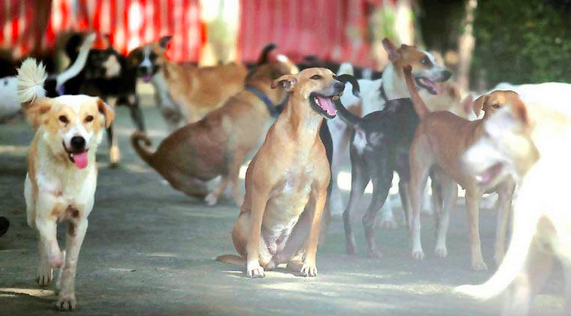
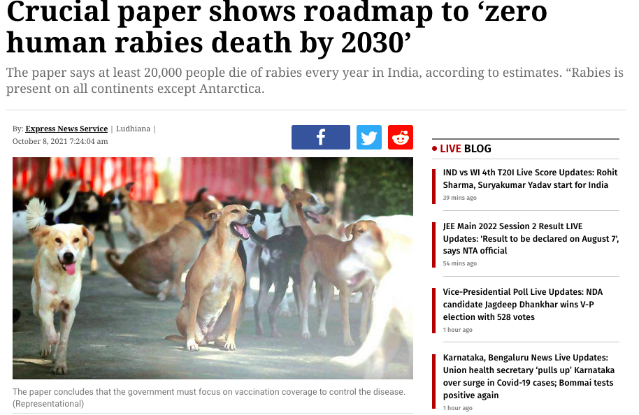
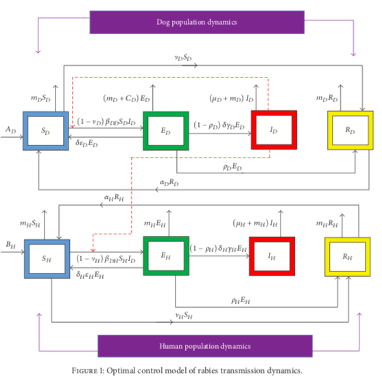
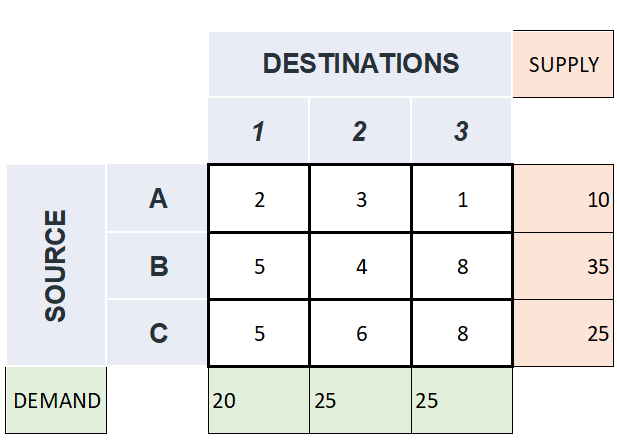
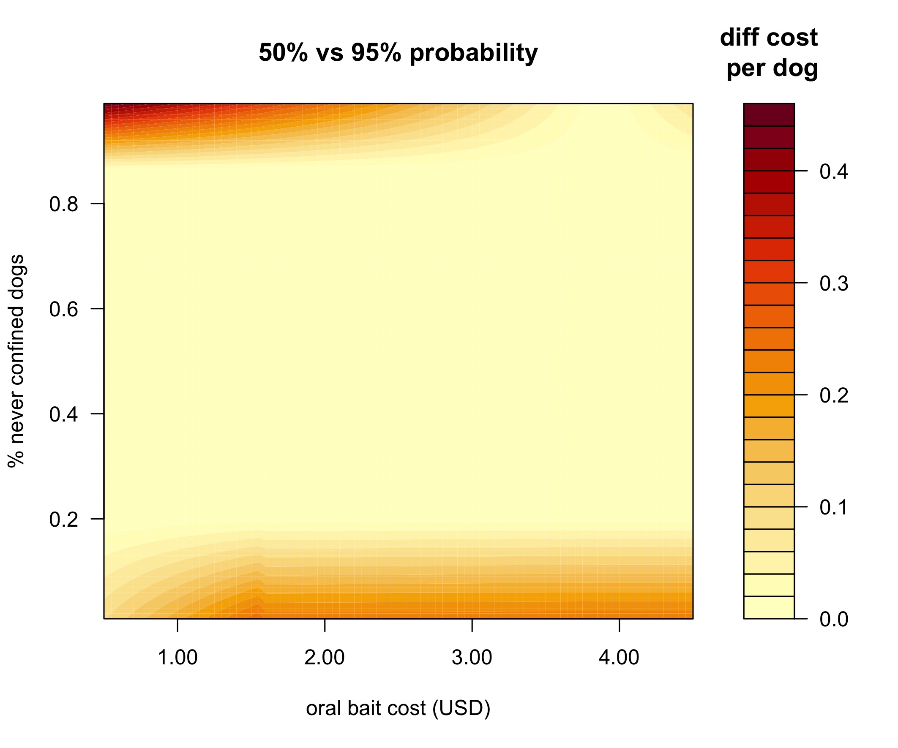

```{r setup, include=FALSE}
library(knitr)
knitr::opts_chunk$set(echo = FALSE)
```
## <font size=50> Optimizing rabies vaccination </font>

```{r, out.width = "80%",fig.align = 'center'}

```
<br><br>
<div class="columns-2">
<div style="float: left; width: 100%;">

Kim Cuddington  
[https://ecotheory.ca](https://ecotheory.ca)<br>
11.08.22
</div>

<div style="float: right; width: 100%;">

```{r, out.width = "80%",fig.align = 'right'}
include_graphics("Waterloo_Science_Logo_horiz_bk.jpg")
```
</div>
</div>
## Plan 
  + Why rabies?
  + Oral baits for vaccination
  + Dog populations in India
  + How can we optimize the rabies vaccination of dogs in India
    - simple deterministic approach: linear programming
    
# Why Rabies?

## What is rabies?

- rabies is caused by a genus of bullet-shaped viruses (Lyssavirus)
- different kinds, or variants, that tend to attack a certain host animal, like raccoons, skunks, or bats, any rabies variant can infect any mammal. 

- in the saliva of infected mammals and can be spread by: (1) bites that break the skin,  (2) getting saliva from an infected animal in an open cut, sore, or other wound, and (3) getting saliva from an infected animal in the mouth, nose, or eyes 

- 99% of cases of human rabies are caused by an infected dog bite ([WHO Rabies Factsheet](https://www.who.int/news-room/fact-sheets/detail/rabies)). There are no documented events of human to human transmission other than in the case of organ transplants. 


## Why rabies?

- the highest mortality rate of all known infectious agents: almost all individuals who progress to clinical symptoms will die within 7 days (Radhakrishnan et al 2020)
- not a reportable disease in most countries, and almost certainly under-reported, especially given that incubation can take from 1-3 months following an encounter with a rabid animal
- the paralytic form of the disease is not widely recognized, and so is frequently misdiagnosed (often as malaria) 
- estimates in databases such as global burden of disease are almost certainly too low
<br>
<font size="7"><span style="color:red">$\rightarrow$</span></font> probably [59,000 human deaths each year](https://www.cdc.gov/rabies/location/world/index.html).  
 
##  Burden of rabies

 - [Hampson et al. (2015)](https://doi.org/10.1371/journal.pntd.0003709) estimated the global welfare impact of human rabies at 3.7 million disability-adjusted human life years (DALYs) lost every year
- the global economic burden of dog-mediated rabies is estimated at US$ 8.6 billion per year ([WHO Rabies Factsheet](https://www.who.int/news-room/fact-sheets/detail/rabies)), 
- 75% of these economic losses are due to premature death and costs associated with seeking treatment [Hampson et al.(2015](https://doi.org/10.1371/journal.pntd.0003709))
- average victim is typically young and living in a rural area 
- post-exposure treatment is expensive, and must be employed unless there is certainty that the dog that bit the patient is negative for rabies
-  83% of the total rabies control costs in both Asia and Africa is put towards post exposure treatment ([Knobel et al. 2005](https://www.scielosp.org/article/ssm/content/raw/?resource_ssm_path=/media/assets/bwho/v83n5/v83n5a12.pdf)), even though, because of costs, a portion of those treated do not finish the course of post-exposure vaccinations. 

## Why rabies now?

- the WHO, FAO (Food and Agriculture Organization) and OIE (World Organization for Animal Health), have prioritized rabies as a model disease for a One Health approach. 
- One Health refers to the collaboration between different disciplines and sectors to recognize the connection between humans, animals, and the environment, and the necessity for integrated health interventions 
- these agencies have launched the ‘United Against Rabies Forum’ which advocates and prioritizes investments in rabies control, and coordinates the global rabies-elimination efforts to achieve zero human deaths from dog-mediated rabies by 2030 ([WHO, FAO, & OIE 2018](https://apps.who.int/iris/handle/10665/272756)). 


## Vaccination of dogs
- the WHO suggests that vaccinating dogs is the most cost-effective strategy for preventing rabies in people, and reduces both human deaths and the need for post-exposure treatment ([WHO Rabies Factsheet](https://www.who.int/news-room/fact-sheets/detail/rabies)). 
 - almost all human deaths occur in Asia and Africa, where there are free-roaming dog populations.
 - investment in dog vaccination accounts for less than 1.5% of the global economic burden of the disease, with considerably smaller investments for Asian and African countries ([Hampson et al. 2015](https://doi.org/10.1371/journal.pntd.0003709)). 

- Mission Rabies, a charitable organization that vaccinates dogs in various countries, estimates that vaccinating a person against rabies can cost up to 50 times more than vaccinating a dog ([Mission Rabies Blog 2021](http://www.missionrabies.com/blog/malawi-almost-15000-vaccinations-and-counting)).


## Rabies in India
-India probably accounts for 36% of rabies deaths, or 18,000 - 20,000 per year ([WHO Rabies in India](https://www.who.int/india/health-topics/rabies)).


```{r, out.width = "80%",fig.align = 'center'}

```
<div style="float: right; width: 100%;">
</div>

## Dog vaccination methods
- in countries like India, where there are many free-roaming dogs that may or may not be owned, various vaccination strategies may be employed
- **central  point vaccination (CP)** is where dog owners bring their pets to a central location such as a veterinarian office, or a community clinic during a vaccination blitz
- **door-to-door (DD)** are strategies are where teams move from house-to-house to vaccinate dogs that can be handled by their owners, but which were not brought to a central point clinic 
- these two strategies have only been successful at large scale where most dogs are responsibly owned (e.g., Latin America; [Vigilato et al. 2013](https://doi.org/10.3201/eid1904.121482))
- for animals that cannot be easily handled, **catch-vaccinate-release (CVR)** entails a team of people capturing the animal in a net, injecting the vaccine and then releasing

## Oral baits for vaccination

<div style="float: left; width: 50%;">
- vaccines are perhaps most frequently delivered via injection; however, for several infectious diseases, orally administered vaccines are available. 
- oral vaccine baits contain or are coated with attractive substances that the target animal is likely to ingest, along with an oral vaccine. 
- baits may be as simple as meat or egg products containing the vaccine, but may also be packaged for easier deployment and shelf-life. 
<br/><br/>
</div>

<div style="float: right; width: 45%;">
```{r, out.width = "100%",fig.align = 'center'}
include_graphics("bait.jpg")
```

</div>


## Oral bait deployment
- allow vaccination of animals that cannot be easily captured or subdued for injection
- baits can be simply scattered, or placed near dogs that cannot be handled
- can therefore reduce the training, manpower and equipment needed for vaccine deployment, while simultaneously accessing more of the animals in an area [(Gibson et al. 2019)](https://doi.org/10.1016/j.jvacx.2019.100015). 

## Successful programs using oral vaccine baits: Rabies in North America & Europe
- oral baits have been used successfully in North America and Europe to control rabies in a variety of wildlife species. 
- for the past 30 years the US has held back the spread of rabies in raccoons to the western states, after the disease was introduced to Virginia in 1981
- the National Rabies Management Program is the largest coordinated effort to control a zoonotic disease in wildlife populations ever undertaken in the U.S.
- costs about \$28 million to run every year (see [Slate et al. 2002)](https://escholarship.org/content/qt3gb9f18h/qt3gb9f18h_noSplash_b06aa9ec7fbdde336a72a2043bf74a10.pdf), but it’s estimated to save taxpayers \$60 million in preventing the need for public health investigations, animal rabies tests, and access to post-exposure vaccines for humans.

## Raccoon rabies in North America (2018)

```{r, out.width = "80%",fig.align = 'center'}
include_graphics("javma.256.2.195.figure.4.jpg")
```
<font size="4"><div align="center">[Ma et al. (2020)](https://doi.org/10.2460/javma.256.2.195)</div></font>


## Rabies bait drop in the US 2022

<div style="float: left; width: 50%;">
- in 2019, the USDA and its partner agencies and organizations estimated they distributed about 9.3 million raccoon rabies vaccine baits in a line roughly 25 miles wide that runs from Maine down to Alabama.
- distributed by plane in rural areas and via helicopter, vehicle, and bait station in suburban or urban spaces.

<br/><br/>
</div>

<div style="float: right; width: 50%;">

```{r, out.width = "100%",fig.align = 'right'}
include_graphics("NArabiesdrop.png")
```
</div>

baits are covered in a fishmeal-based coating to encourage consumption by raccoons, coyotes, and other animals

## Oral baits in Canada

```{r, out.width = "80%",fig.align = 'center'}
include_graphics("ontariobait.png")
```


## Trial of oral baits in India by Mission Rabies
- Mission Rabies conducted a pilot test of oral baiting in Goa, India in 2018 ([Mission Rabies](http://www.missionrabies.com/blog/oral-vaccines-could-provide-the-answer-to-rabies-elimination-in-stray-dogs)), where two vaccination strategies were compared
- either teams of two traveled by scooter and offered dogs an empty oral bait construct, or teams of seven traveled by supply vehicle and used nets to catch dogs for parenteral vaccination ([Gibson et al. 2019](https://doi.org/10.1016/j.jvacx.2019.100015)).
- the fixed operational team cost of catch-vaccinate-release was four times higher than oral bait handouts, at \$127 USD per day, compared to \$34 USD per day. 
- use of oral baits also increased the proportion of dogs accessible for vaccination by 17% overall, and consistently reached a larger proportion of animals across land use types. 
- staff also reported that dogs are more likely to run away from the net catching teams and alert dogs in the area by barking, while oral bait teams reported that dogs were often attracted to the baits and would gather around them.


## Oral baits trial in India and estimated costs
```{r, out.width = "86%",fig.align = 'center'}
include_graphics("OBHvsCVR.png")
```
<font size="4"><div align="center">
Figure 1: Cost estimates for canine injectable and oral bait rabies vaccines from [Wallace et al. (2020)](https://doi.org/10.1017/S0950268819001158), where bars give the median estimate in US dollars, and lines indicate the probable range (a). Estimated vaccination rates from [Gibson et al. (2019)](https://doi.org/10.1016/j.jvacx.2019.100015) where bars given the mean number of dogs vaccinated per team member per 6 hour day and lines indicate the 95% confidence intervals about these estimates (b).</div></font>

## Disease dynamics modelling of rabies (not doing this!)
```{r, out.width = "60%",fig.align = 'center'}

```

<font size=4><div align="center">[Asamoah et al 2017](https://www.hindawi.com/journals/jam/2017/2451237/)</div></font>

## Data limitations

- most published estimates of dog population size do not seem to be supported by data (see Appendix 1).
- using reports of ratios of human to dog populations in urban and rural areas, we estimate a total free-roaming dog population of 38 million in 2020 with  order of magnitude error bounds on this estimate (Appendix 1). 
- the actual incidence of rabies in dog populations is not known (Belsare and Gompper 2013).
- however, we need not delay vaccination programs because of lack of information on the actual size of the free-roaming dog population or the rabies incidence rates 

## Design vaccination progam for an Indian city

+ 4 different methods of vaccination
    - central point (CP) (e.g., take the dog to the vet)
    - door to door (DD) (2 person crew, small vehicle)
    - catch, vaccinate, release (CVR) (5-6 person crew, large vehicle)
    - oral bait handout (ORV) (2 person crew, small vehicle)
  
+ 3 categories of dogs: 
    - always confined (C) 
    - sometimes confined (SC) 
    - never confined (NC)

## Costs of vaccination program

```{r, out.width = "90%",fig.align = 'center'}
include_graphics("tablecosts.png")
```
<font size="4"><div align="center">[Gibson et al. (2020)](https://doi.org/10.3390/tropicalmed5010047)</div></font>


## Vaccine efficacy
<br><br> 
```{r, out.width = "100%",fig.align = 'center'}
include_graphics("vaxeffGbison.png")
```
<font size="4"><div align="center">[Gibson et al. (2020)](https://doi.org/10.3390/tropicalmed5010047)</div></font>


## Linear programming (deterministic optimization)
<div class="columns-2">
<div style="float: left; width: 100%;">

- e.g. transportation problem with constraints: a combinatorial problem that deals with transporting items from multiple sources to multiple destinations at minimum cost
- each vaccination method has a different cost, 
- each vaccation method has a different efficacy for each category of dog
- minimize cost of the program, while ensuring that $R_0<1$
</div>
<div style="float: right; width: 100%;">
```{r, out.width = "100%",fig.align = 'center'}

```
<font size="4"><div align="center">Image by [Akhitha Babu](https://towardsdatascience.com/optimization-in-transportation-problem-f8137044b371)</div></font>

</div>
</div>

## One means of optimizating health interventions
- approach has been used for other similar health care problems (e.g., Earnshaw et al. 2002 Optimal Allocation of Resources across Four Interventions for Type 2 Diabetes)
- very simple place to start
- (I think) compares favourably to the use of excel spreadsheets! 

## Linear programming (deterministic optimization)

- objective function:  $\min\sum \sum {c_j}x_{ij}$,</br> 
  - where $c_j$ is the cost for each vaccination method,  and $x_{ij}$ is the number of dogs vaccinated in each category, $i$ by method $j$</font>
- such that: for each dog category, $i$, $\sum{x_{i}v_{ij}} \geq 0.7d_i$
  - where $d_i$ is the number of dogs in each category in the population 
  - $v_{ij}$ is the efficacy of method $j$ on dog category $i$
  - 0.7 is vaccination rate given in the literature regarding $R_0<1$ 
  - annual vaccination of over 70% of the dog population may stop transmission  (e.g., [Coleman & Dye 1996)](https://doi.org/10.1016/0264-410X(95)).
 
## Uncertainty regarding oral bait cost
- current estimates suggest oral bait is 5x more expensive than injectable 
- no current supplier in India
- not yet approved
- Research question: would charitable efforts aimed at increasing accessibility and reducing the cost of oral baits be helpful?

## Investigate optimization under uncertainty about oral bait price
- one approach: systematic search
- find optimal solution and compare to solution without oral baits
- answer the question: do oral baits lower the per dog cost of a vaccination program

## Use of oral baits reduces per dog cost of vaccination
```{r, out.width = "85%",fig.align = 'center'}
include_graphics("breakeven.jpeg")
```


## Use of oral baits is optimal for many combos
```{r, out.width = "85%",fig.align = 'center'}
include_graphics("surfacecost.jpeg")
```

## Three classes of solutions
- given % of NC, remaining dogs dividing evenly between C and SC, find all optimal solutions across a range of price
- cluster solutions using kmeans
- if bait cost > $3.9 and NC > 0.48 use CVR (1), if not use ORV (2),  otherwise use mixed (2)


```{r, out.width = "65%",fig.align = 'center'}
include_graphics("tablesoln.png")
```
 

## Acceptable risk
- relatively low transmission rates
- in some populations vaccination coverage of even a small percentage of the dog population may be sufficient to substantially reduce economic and DALY impacts
- e.g., [Fitzpatrick et al. (2016](https://doi.org/10.1073/pnas.1604975113)) predict an 88% reduction in annual human rabies deaths for an ongoing program of canine vaccination that reaches ∼13% of the overall dog population.


        
## Optimization under uncertainty: chance constraint
- objective function:  $\min f(x, \zeta)$,</br> 
 
- such that:  $h(x,\zeta)\geq0$
  - where $x$ is the decision vector, and $\zeta$ is the vector of uncertainty
  
- under chance constraint, reformulate the inequality constraint as
$P(h(x,\zeta)\geq0)\geq p$, where $p \in [0,1]$
- relax the problem into equivalent deterministic (i.e., use the probability density function and substitute the left hand side of the constraint with a deterministic expression)
- issues with convexity and stability can mean that small changes in the actual density function could cause major changes in the optimal solution

## Optimization under uncertainty: chance constraint
- simplest: individual chance constraint
- objective function:  $\min\sum \sum {c_j}x_{ij}$,</br> 
  - where $c_j$ is the cost for each vaccination method,  and $x_{ij}$ is the number of dogs vaccinated in each category, $i$ by method $j$</font>
- such that: for each dog category, $i$, 
$$ P \left( \sum x_{ij} v_{ij} \geq \zeta_{i} )\right) \geq p$$ 
  - where $v_{ij}$ is the efficacy of method $j$ on dog category $i$ and $\zeta_i$ is the number of vaccinated dogs required to achieve $R_0<1$, and p is a given probability
  
## Optimization under uncertainty: chance constraint 
- if we assume that $\zeta_i$ is normally distributed with mean $d_i$ and variance $\sigma^2_i$, we can transform the constraint for each i into $$P\left(\sum x_{ij}v_{ij}\right) \ge d_i + \sigma_i q_p,$$
where $q_p$ is the p-quantile of the standard normal distribution. 

- then solve as usual for a given p

## Comparing costs for different risks

```{r, out.width = "85%",fig.align = 'center'}

```
 

## Conclusion: Oral baits will substantially reduce costs 

- across the scenarios investigated here:
1. oral baits reduce the per dog cost of a 1 month vaccination program
2. also reduce number of staff and their training needs (not shown here)
3. cheaper and more feasible to use oral baits

- caveat: EVERY parameter here is very uncertain

## Open Science

- providing data, source code and dynamic documents to make work completely reproducible 
- Note this document and figures provided at [https://github.com/kcudding/rabies/blob/main/rabies.md](https://github.com/kcudding/rabies/blob/main/rabies.md)

<br><br>

```{r, out.width = "60%", fig.align = 'center'}
include_graphics("https://imgs.xkcd.com/comics/how_it_works.png")
```
<font size="2"><div align="center">https://xkcd.com/385/ </div></font>


## Acknowledgements

Thanks to several reviewers for feedback on this work. <br><br>
Especial thanks to William McAuliffe for thoughtful comments, careful proofing and for being willing to read horrible excel spreadsheets.

## Funding

<div style="float: left; width: 80%;">
This work was supported by <br> Rethink Priorities ([https://rethinkpriorities.org/](https://rethinkpriorities.org/))
</div>
<div style="float: right; width: 20%;">
```{r, out.width = "130%", fig.align = 'right'}

```
</div>

## Lit Cited
<font size="1">
Coleman, P. G., & Dye, C. (1996). Immunization coverage required to prevent outbreaks of dog rabies. Vaccine, 14(3), 185–186. [https://doi.org/10.1016/0264-410X(95)00197-9](https://doi.org/10.1016/0264-410X(95)00197-9)</font>
<br><font size="1"> Gibson, A. D., et al. (2019). Oral bait handout as a method to access roaming dogs for rabies vaccination in Goa, India: A proof of principle study. Vaccine: X, 1, 100015. [https://doi.org/10.1016/j.jvacx.2019.100015](https://doi.org/10.1016/j.jvacx.2019.100015)</font><br>
<font size="1">Fitzpatrick, M. C., et al. (2016). One Health approach to cost-effective rabies control in India. Proceedings of the National Academy of Sciences, 113(51), 14574–14581. [https://doi.org/10.1073/pnas.1604975113](https://doi.org/10.1073/pnas.1604975113)</font>
<br><font size="1">Gibson, A. D., et al. (2020). Reviewing Solutions of Scale for Canine Rabies Elimination in India. Tropical Medicine and Infectious Disease, 5(1), 47. [https://doi.org/10.3390/tropicalmed5010047](https://doi.org/10.3390/tropicalmed5010047)</font><br>
<font size="1">Gibson, A. D., et al. (2019). Oral bait handout as a method to access roaming dogs for rabies vaccination in Goa, India: A proof of principle study. Vaccine: X, 1, 100015. [https://doi.org/10.1016/j.jvacx.2019.100015](https://doi.org/10.1016/j.jvacx.2019.100015)</font><br>
<font size="1">Hampson, K., et al. (2015). Estimating the Global Burden of Endemic Canine Rabies. PLOS Neglected Tropical Diseases, 9(4), e0003709. [https://doi.org/10.1371/journal.pntd.0003709](https://doi.org/10.1371/journal.pntd.0003709)</font><br>
<font size="1">Morters, M. K., Restif, O., Hampson, K., Cleaveland, S., Wood, J. L., & Conlan, A. J. (2013). Evidence‐based control of canine rabies: a critical review of population density reduction. Journal of animal ecology, 82(1), 6-14. [https://besjournals.onlinelibrary.wiley.com/doi/full/10.1111/j.1365-2656.2012.02033.x](https://besjournals.onlinelibrary.wiley.com/doi/full/10.1111/j.1365-2656.2012.02033.x)</font><br>

## Lit Cited cont'd
<font size="1">One Health High Level Expert Panel (2021) Joint Tripartite (FAO, OIE, WHO) and UNEP Statement Tripartite and UNEP support OHHLEP’s definition of “One Health”
[https://wedocs.unep.org/bitstream/handle/20.500.11822/37600/JTFOWU.pdf](https://wedocs.unep.org/bitstream/handle/20.500.11822/37600/JTFOWU.pdf)</font><br><font size="1">Radhakrishnan, S., et al. (2020). Rabies as a public health concern in India—A historical perspective. Tropical medicine and infectious disease, 5(4), 162.</font><br>
<font size="1">Slate, D. et al. (2002). Oral rabies vaccination: a national perspective on program development and implementation. USDA National Wildlife Research Center-Staff Publications, 476. [https://escholarship.org/content/qt3gb9f18h/qt3gb9f18h_noSplash_b06aa9ec7fbdde336a72a2043bf74a10.pdf](https://escholarship.org/content/qt3gb9f18h/qt3gb9f18h_noSplash_b06aa9ec7fbdde336a72a2043bf74a10.pdf)</font><br>
<font size="1">Wallace, R. M., Undurraga, E. A., Gibson, A., Boone, J., Pieracci, E. G., Gamble, L., & Blanton, J. D. (2019). Estimating the effectiveness of vaccine programs in dog populations. Epidemiology & Infection, 147. [https://doi.org/10.1017/S0950268819001158](https://doi.org/10.1017/S0950268819001158)</font><br>
<font size="1">WHO Rabies Factsheet. (n.d.). Retrieved July 29, 2021, from [https://www.who.int/news-room/fact-sheets/detail/rabies](https://www.who.int/news-room/fact-sheets/detail/rabies)</font><br>
<font size="1">WHO Rabies—India. (n.d.). Retrieved July 30, 2021, from [https://www.who.int/india/health-topics/rabies](https://www.who.int/india/health-topics/rabies)</font><br>
<font size="1">WHO (2019) First annual progress report Global Strategic Plan to End Human Deaths from Dog-mediated Rabies by 2030. Retrieved November 20, 2021, from [https://www.who.int/publications-detail-redirect/WHO-CDS-NTD-NZD-2019.04](https://www.who.int/publications-detail-redirect/WHO-CDS-NTD-NZD-2019.04)</font><br>
<font size="1">WHO (2018). WHO expert consultation on rabies: Third report. World Health Organization. [https://apps.who.int/iris/handle/10665/272364](https://apps.who.int/iris/handle/10665/272364)</font><br>
<font size="1">WHO, FAO, & OIE. (2018). Zero by 30: The global strategic plan to end human deaths from dog-mediated rabies by 2030. World Health Organization. [https://apps.who.int/iris/handle/10665/272756](https://apps.who.int/iris/handle/10665/272756)</font><br>

## What about culling?
- little evidence that culling is an effective control measure (see review Morters et al. 2013), possibly because dog-to-human transmission is not strictly density-dependent. d- Data and modeling also indicate that combining vaccination with surgical sterilization is not usually a cost-effective means of controlling rabies transmission to humans. 
- in a model for the Tamil Nadu region of India, Fitzpatrick et al. (2016) noted that the main impacts of sterilization were to reduce population turnover so that fewer dogs needed be vaccinated to maintain herd immunity, and to permanently mark the dogs so that vaccine doses were not wasted on animals that still had immunity. 

## Optimization problem: maximize effective vaccination for a fixed cost (deterministic, and then stochastic)
- maximize effective vaccination rate, while not exceeding budget (e.g., $30,000)
    - objective function:  $\max\sum \frac{\sum{v_{ij}x_{ij}}}{d_i}$,</br> 
        - where  $v_{ij}$ is the efficacy of method $j$ on dog category $i$, and $x_{ij}$ is the number of dogs vaccinated in each category, $i$ by method $j$ and $d_i$ is the total number of dogs in the category $i$</font>
    - such that: all $\sum {c_{j}x_{ij}} < \$30 000$, 
        - $c_j$ is the cost for each vaccination method

## What do you think?

- always want your feedback (https://github.com/kcudding/rabies/issues)

