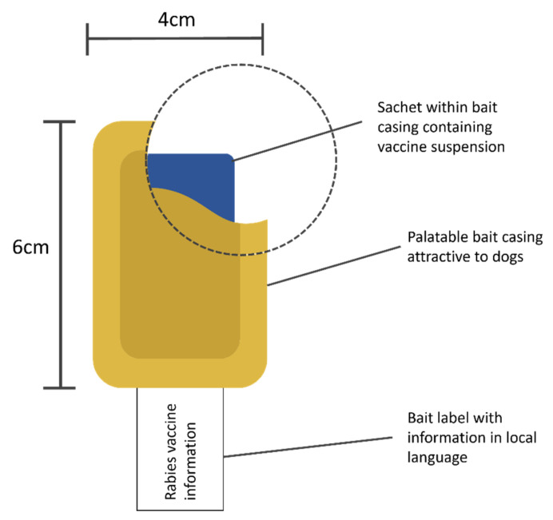
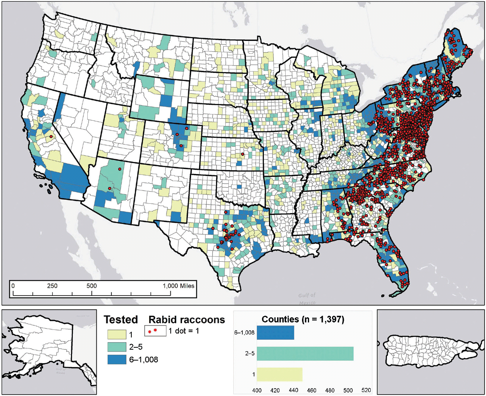
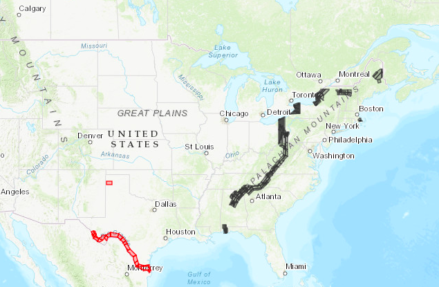
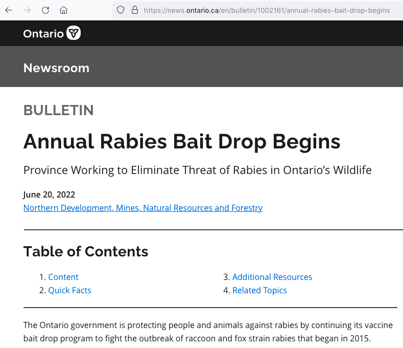
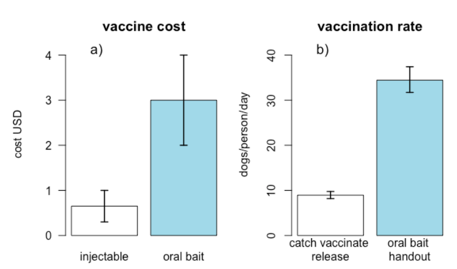
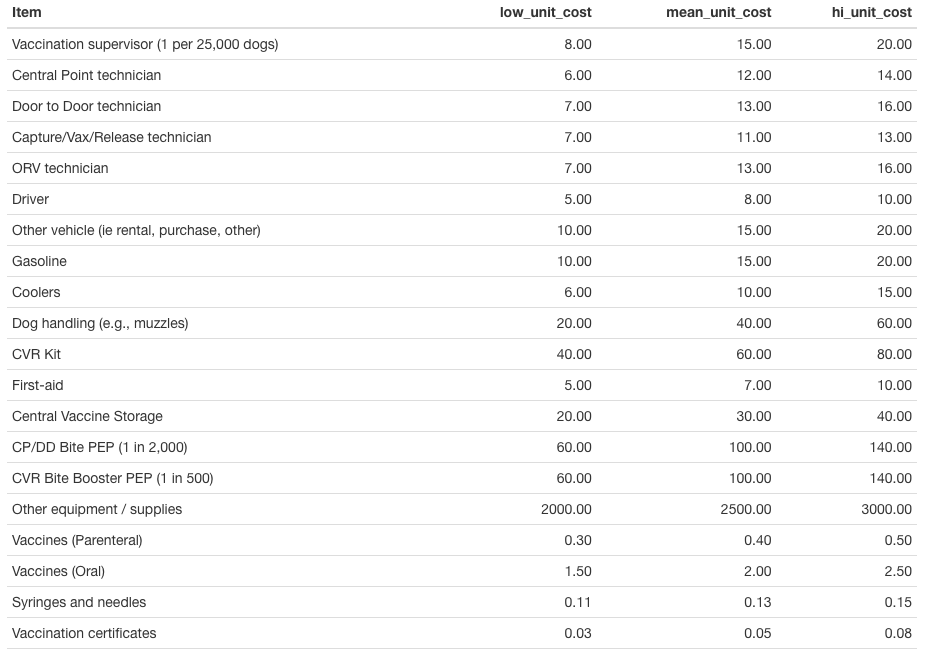
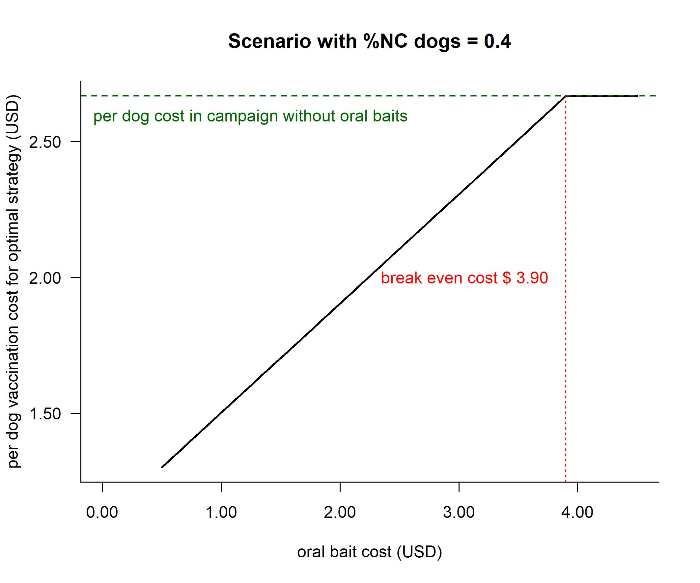
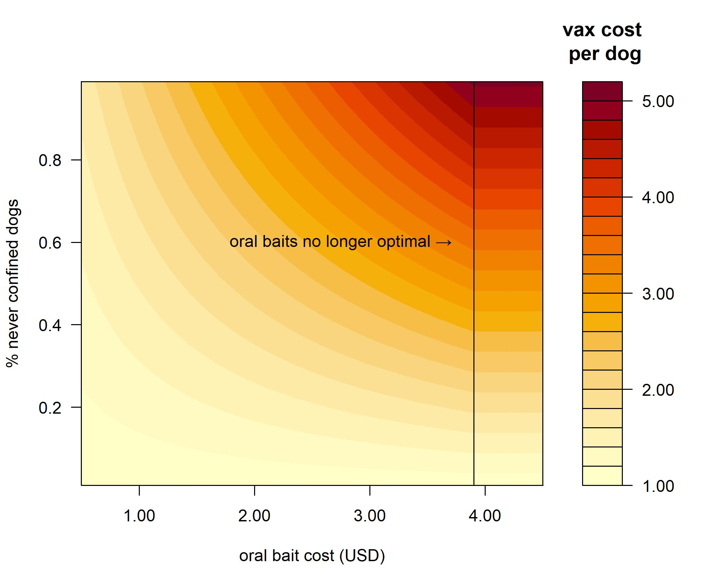

---
title: 'Optimizing rabies vaccination'

author: "Kim Cuddington (https://ecotheory.ca)"
date: "17/08/2022"
output: 
  ioslides_presentation: 
    keep_md: yes
smaller: true
css: quantbiotalk.css
---

```{r setup, include=FALSE}
library(knitr)
knitr::opts_chunk$set(echo = FALSE)
```


## Plan 
  + Why rabies?
  + Oral bait for vaccination
  + Dog populations in India
  + How can we optimize the rabies vaccinaiton of dogs in India
    - simple deterministic approach: linear programming
    
# Why Rabies?

## What is rabies?

- rabies is caused by a genus of bullet-shaped viruses (Lyssavirus)
- different kinds, or variants, that tend to attack a certain host animal, like raccoons, skunks, or bats, any rabies variant can infect any mammal. 

- in the saliva of infected mammals and can be spread by: (1) bites that break the skin,  (2) getting saliva from an infected animal in an open cut, sore, or other wound, and (3) getting saliva from an infected animal in the mouth, nose, or eyes 

- Over 99% of cases of human rabies are caused by an infected dog bite ([WHO Rabies Factsheet](https://www.who.int/news-room/fact-sheets/detail/rabies)). There are no documented events of human to human transmission other than in the case of organ transplants. 


## Rabies

- the highest mortality rate of all known infectious agents: almost all individuals who progress to clinical symptoms will die (Radhakrishnan et al 2020). In humans, death usually occurs within 7 days of clinical symptoms. 
- not a reportable disease in most countries, and almost certainly under-reported, especially given that incubation can take from 1-3 months following an encounter with a rabid animal.
- the paralytic form of the disease is not widely recognized, and so is frequently misdiagnosed (often as malaria). 
- estimates in databases such as global burden of disease are almost certainly too low
<br>
<font size="7"><span style="color:red">$\rightarrow$</span></font> probably [59,000 human deaths each year](https://www.cdc.gov/rabies/location/world/index.html).  
 
## Economic burden of rabies

 - the human welfare impact of this disease is primarily related to the effects of lives lost. [Hampson et al. (2015)](https://doi.org/10.1371/journal.pntd.0003709) estimated the global welfare impact of human rabies transmitted by dogs at 3.7 million disability-adjusted human life years (DALYs) lost every year.
- the global economic burden of dog-mediated rabies is estimated at US$ 8.6 billion per year ([WHO Rabies Factsheet](https://www.who.int/news-room/fact-sheets/detail/rabies)), although  [Anderson and Shwiff (2015)](https://doi.org/10.1111/tbed.12168) estimated the global economic burden of canine rabies at US\$ 124.2 billion annually, using a different accounting for the losses due to premature death
- under this first accounting, that 75% of these economic losses are due to premature death and costs associated with seeking treatment [Hampson et al.(2015](https://doi.org/10.1371/journal.pntd.0003709))
- post-exposure treatment is expensive, particularly for the average victim in developing countries (typically young and living in a rural area), and must be employed unless there is certainty that the dog that bit the patient is negative for rabies
-  83% of the total rabies control costs in both Asia and Africa is put towards post exposure treatment ([Knobel et al. 2005](https://www.scielosp.org/article/ssm/content/raw/?resource_ssm_path=/media/assets/bwho/v83n5/v83n5a12.pdf)), even though, because of costs, a portion of those treated do not finish the course of post-exposure vaccinations. 

## Why Rabies now?

- The WHO, FAO (Food and Agriculture Organization) and OIE (World Organization for Animal Health), have prioritized rabies as a model disease for a One Health approach. 
- One Health refers to the collaboration between different disciplines and sectors to recognize the connection between humans, animals, and the environment, and the necessity for integrated health interventions (learn more in this short course offered by WHO). 
- In addition, these agencies have launched the ‘United Against Rabies Forum’ which advocates and prioritizes investments in rabies control, and coordinates the global rabies-elimination efforts to achieve zero human deaths from dog-mediated rabies by 2030 ([WHO, FAO, & OIE 2018](https://apps.who.int/iris/handle/10665/272756)). 


## Vaccination of dogs
- The WHO suggests that vaccinating dogs is the most cost-effective strategy for preventing rabies in people, and reduces both human deaths and the need for post-exposure treatment ([WHO Rabies Factsheet](https://www.who.int/news-room/fact-sheets/detail/rabies)). 

- Mission Rabies, a charitable organization that vaccinates dogs in various countries, estimates that vaccinating a person against rabies can cost up to 50 times more than vaccinating a dog ([Mission Rabies Blog 2021](http://www.missionrabies.com/blog/malawi-almost-15000-vaccinations-and-counting)).


## Rabies in India

<div style="float: right; width: 100%;">

```{r, out.width = "100%",fig.align = 'right'}
include_graphics("Indianews.png")
```

</div>

## Dog vaccination to counteract rabies in India
 - Almost all human deaths occur in Asia and Africa, where there are free-roaming dog populations.
 - investment in dog vaccination accounts for less than 1.5% of the global economic burden of the disease, with considerably smaller investments for Asian and African countries ([Hampson et al. 2015](https://doi.org/10.1371/journal.pntd.0003709)). 
-India probably accounts for 36% of rabies deaths, or 18,000 - 20,000 per year ([WHO Rabies in India](https://www.who.int/india/health-topics/rabies)).

## Oral baits for vaccination

<div style="float: left; width: 50%;">
- Vaccines are perhaps most frequently delivered via injection; however, for several infectious diseases, orally administered vaccines are available. 
- oral vaccine baits contain or are coated with attractive substances that the target animal is likely to ingest, along with an oral vaccine. 

<br/><br/>
</div>

<div style="float: right; width: 45%;">
```{r, out.width = "100%",fig.align = 'center'}

```
</break>
</break>
</div>

+ Baits may be as simple as meat or egg products containing the vaccine, but may also be packaged for easier deployment and shelf-life. 

## Oral bait deployment
- allow vaccination of animals that cannot be easily captured or subdued for injection
- can therefore reduce the training, manpower and equipment needed for vaccine deployment, while simultaneously accessing more of the animals in an area (Gibson et al. 2019). 

## Successful programs using oral vaccine baits: Rabies in North America & Europe
- Oral baits have been used successfully in North America and Europe to control rabies in a variety of wildlife species. 
- For the past 30 years the US has held back the spread of rabies in raccoons to the western states, after the disease was introduced to Virginia. The National Rabies Management Program is the largest coordinated effort to control a zoonotic disease in wildlife populations ever undertaken in the U.S.
- The program costs about \$28 million to run every year (see Slate et al. 2002), but it’s estimated to save taxpayers \$60 million in preventing the need for public health investigations, animal rabies tests, and access to post-exposure vaccines for humans.

## Raccoon rabies in North America (2018)

```{r, out.width = "80%",fig.align = 'center'}

```
<font size="4"><div align="center">[Ma et al. (2020)](https://doi.org/10.2460/javma.256.2.195)</div></font>


## Rabies bait drop in the US 2022

<div style="float: left; width: 50%;">
- in 2019, the USDA and its partner agencies and organizations estimated they distributed about 9.3 million raccoon rabies vaccine baits in a line roughly 25 miles wide that runs from Maine down to Alabama.
- distributed by plane in rural areas and via helicopter, vehicle, and bait station in suburban or urban spaces.

<br/><br/>
</div>

<div style="float: right; width: 50%;">

```{r, out.width = "100%",fig.align = 'right'}

```
</div>

baits are covered in a fishmeal-based coating to encourage consumption by raccoons, coyotes, and other animals

## Oral baits in Canada

```{r, out.width = "100%",fig.align = 'right'}

```


## Trial of oral baits in India by Mission Rabies

- synchronized mass dog vaccination campaigns in 12 cities using catch-vaccinate-release. They vaccinated 54,227 dogs with an average vaccination rate of 14.6 (CI 10- 20) dogs/person/day (Gibson et al. 2020). Post vaccination surveys at five of the sites indicated coverage rates of about 71.2%.
- Extrapolation to a two week India national campaign suggested that 1.1 million staff and 160,000 trucks would be required using conventional injection implementing catch-vaccinate-release (Gibson et al. 2019). 
- For the oral bait handout technique, Gibson et al. (2019) calculated that only 293,000 staff and 150,000 scooters would be needed for an annual two-week India-wide vaccination program 


## Oral baits trial in India and estimated costs
```{r, out.width = "86%",fig.align = 'center'}

```
<font size="4"><div align="center">
Figure 1: Cost estimates for canine injectable and oral bait rabies vaccines from Wallace et al. (2020), where bars give the median estimate in US dollars, and lines indicate the probable range (a). Estimated vaccination rates from Gibson et al. (2019) where bars given the mean number of dogs vaccinated per team member per 6 hour day and lines indicate the 95% confidence intervals about these estimates (b).</div></font>

## Design vaccination progam for an Indian city

+ 4 different methods of vaccination
    - central point (CP) (e.g., take the dog to the vet)
    - door to door (DD) (2 person crew, small vehicle)
    - catch, vaccinate, release (CVR) (5-6 person crew, large vehicle)
    - oral bait handout (OBH) (2 person crew, small vehicle)
  
+ 3 categories of dogs: 
    - always confined (C) 
    - sometimes confined (SC) 
    - never confined (NC)

## Costs of vaccination program

```{r, out.width = "90%",fig.align = 'center'}

```
<font size="4"><div align="center">[Gibson et al. (2020)](https://doi.org/10.3390/tropicalmed5010047)</div></font>

## Linear programming (deterministic optimization)
- e.g. transportation problem with constraints
- each vaccination method has a different cost, 
- each vaccation method has a different efficacy for each category of dog
- minimize cost of the program, while ensuring that $R_0<1$

## Linear programming (deterministic optimization)

- objective function:  $\min\sum \sum {c_j}x_{ij}$,</br> 
  - where $c_j$ is the cost for each vaccination method,  and $x_{ij}$ is the number of dogs vaccinated in each category, $i$ by method $j$</font>
- such that: for each dog category, $i$, $\frac{\sum{x_{i}v_{ij}}}{{d_i}} > 0.7$
  - where $d_i$ is the number of dogs in each category in the population 
  - $v_{ij}$ is the efficacy of method $j$ on dog category $i$
  - 0.7 is vaccination rate given in the literature regarding $R_0<1$ 
  - annual vaccination of over 70% of the dog population may stop transmission  (e.g., [Coleman & Dye 1996)](https://doi.org/10.1016/0264-410X(95)).
 
## Uncertainty regarding oral bait cost
- no current supplier in India
- not yet approved
- charitable efforts aimed at reducing this cost

## Investigate optimization under uncertainty about oral bait price
- one approach: systematic search
- find optimal solution and compare to solution without oral baits
- answer the question do oral baits lower the cost of a vaccination program

## Use of oral baits reduce per dog cost of vaccination
```{r, out.width = "85%",fig.align = 'center'}

```


## Use of oral baits reduce per dog cost of vaccination
```{r, out.width = "85%",fig.align = 'center'}

```
 
## Fixed budget and acceptable risk
- relatively low transmission rates
- in some populations vaccination coverage of even a small percentage of the dog population may be sufficient to substantially reduce economic and DALY impacts
- e.g., [Fitzpatrick et al. (2016](https://doi.org/10.1073/pnas.1604975113)) predict an 88% reduction in annual human rabies deaths for an ongoing program of canine vaccination that reaches ∼13% of the overall dog population.

## Optimization problem maximize effective vaccination (deterministic)
- maximize effective vaccination rate, while not exceeding budget (e.g., $30,000)
    - objective function:  $\max\sum \frac{\sum{v_{ij}x_{ij}}}{d_i}$,</br> 
        - where  $v_{ij}$ is the efficacy of method $j$ on dog category $i$, and $x_{ij}$ is the number of dogs vaccinated in each category, $i$ by method $j$ and $d_i$ is the total number of dogs in the category $i$</font>
    - such that: all $\sum {c_{j}x_{ij}} < \$30 000$, 
        - $c_j$ is the cost for each vaccination method

## Conclusion: Oral baits will substanitally reduce costs 

- stuff here
1. point
2. point

- caveat


## Open Science

- providing data, source code and dynamic documents to make work completely reproducible 
- Note this document and figures provided at [https://github.com/kcudding/rabies/rabies.md](https://github.com/kcudding/rabies/rabies.md)

```{r, out.width = "60%", fig.align = 'center'}
include_graphics("https://imgs.xkcd.com/comics/how_it_works.png")
```
<font size="2"><div align="center">https://xkcd.com/385/ </div></font>


## Acknowledgements

Thanks to several reviewers for feedback on this work. <br><br>
Especial thanks to William McAuliffe for thoughtful comments, careful proofing and for being willing to read horrible excel spreadsheets.

## Funding

<div style="float: left; width: 80%;">
This work was supported by <br> Rethink Priorities ([https://rethinkpriorities.org/](https://rethinkpriorities.org/))
</div>
<div style="float: right; width: 20%;">
```{r, out.width = "130%", fig.align = 'right'}
include_graphics("rp-logos-04.png")
```
</div>

## Other references
<font size="1">Gibson, A. D., et al. (2019). Oral bait handout as a method to access roaming dogs for rabies vaccination in Goa, India: A proof of principle study. Vaccine: X, 1, 100015. [https://doi.org/10.1016/j.jvacx.2019.100015](https://doi.org/10.1016/j.jvacx.2019.100015)

Gibson, A. D., et al. (2020). Reviewing Solutions of Scale for Canine Rabies Elimination in India. Tropical Medicine and Infectious Disease, 5(1), 47. [https://doi.org/10.3390/tropicalmed5010047](https://doi.org/10.3390/tropicalmed5010047)</font>


## What do you think?

- always want your feedback (https://www.quantitative-biology.ca/index.html#feedback)

